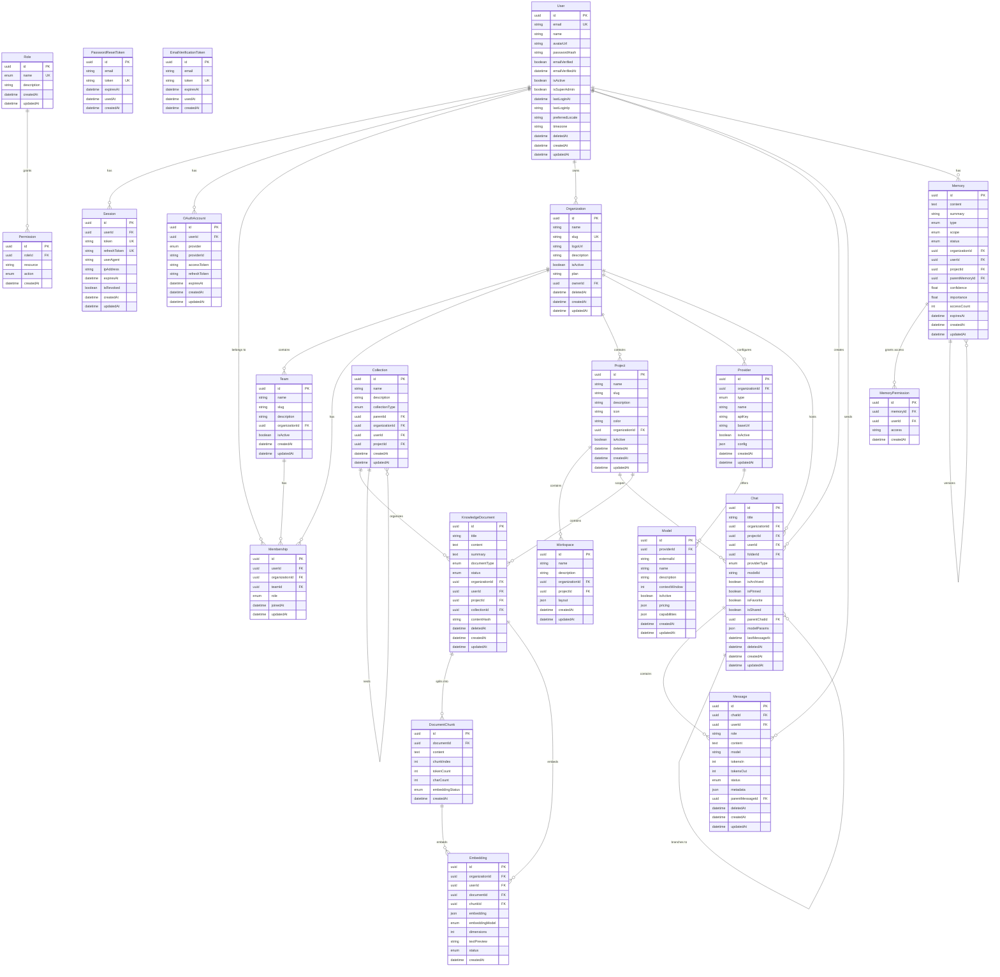
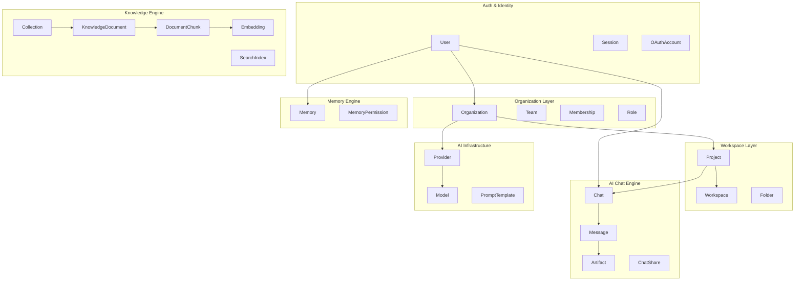

# Moataz AI — Entity Relationship Diagram

## Complete ER Diagram (Mermaid)

```mermaid
erDiagram
    %% ━━━━━━━━━━━━━━━━━━━━━━━━━━━━━━━━━━
    %% CORE: Users & Auth
    %% ━━━━━━━━━━━━━━━━━━━━━━━━━━━━━━━━━━

    User {
        uuid id PK
        string email UK
        string name
        string avatarUrl
        string passwordHash
        boolean emailVerified
        datetime emailVerifiedAt
        boolean isActive
        boolean isSuperAdmin
        datetime lastLoginAt
        string lastLoginIp
        string preferredLocale
        string timezone
        datetime deletedAt
        datetime createdAt
        datetime updatedAt
    }

    Session {
        uuid id PK
        uuid userId FK
        string token UK
        string refreshToken UK
        string userAgent
        string ipAddress
        datetime expiresAt
        boolean isRevoked
        datetime createdAt
        datetime updatedAt
    }

    OAuthAccount {
        uuid id PK
        uuid userId FK
        enum provider
        string providerId
        string accessToken
        string refreshToken
        datetime expiresAt
        datetime createdAt
        datetime updatedAt
    }

    PasswordResetToken {
        uuid id PK
        string email
        string token UK
        datetime expiresAt
        datetime usedAt
        datetime createdAt
    }

    EmailVerificationToken {
        uuid id PK
        string email
        string token UK
        datetime expiresAt
        datetime usedAt
        datetime createdAt
    }

    %% ━━━━━━━━━━━━━━━━━━━━━━━━━━━━━━━━━━
    %% Organizations & Teams
    %% ━━━━━━━━━━━━━━━━━━━━━━━━━━━━━━━━━━

    Organization {
        uuid id PK
        string name
        string slug UK
        string logoUrl
        string description
        boolean isActive
        string plan
        uuid ownerId FK
        datetime deletedAt
        datetime createdAt
        datetime updatedAt
    }

    Team {
        uuid id PK
        string name
        string slug
        string description
        uuid organizationId FK
        boolean isActive
        datetime createdAt
        datetime updatedAt
    }

    Membership {
        uuid id PK
        uuid userId FK
        uuid organizationId FK
        uuid teamId FK
        enum role
        datetime joinedAt
        datetime updatedAt
    }

    %% ━━━━━━━━━━━━━━━━━━━━━━━━━━━━━━━━━━
    %% RBAC
    %% ━━━━━━━━━━━━━━━━━━━━━━━━━━━━━━━━━━

    Role {
        uuid id PK
        enum name UK
        string description
        datetime createdAt
        datetime updatedAt
    }

    Permission {
        uuid id PK
        uuid roleId FK
        string resource
        enum action
        datetime createdAt
    }

    %% ━━━━━━━━━━━━━━━━━━━━━━━━━━━━━━━━━━
    %% Projects & Workspaces
    %% ━━━━━━━━━━━━━━━━━━━━━━━━━━━━━━━━━━

    Project {
        uuid id PK
        string name
        string slug
        string description
        string icon
        string color
        uuid organizationId FK
        boolean isActive
        datetime deletedAt
        datetime createdAt
        datetime updatedAt
    }

    Workspace {
        uuid id PK
        string name
        string description
        uuid organizationId FK
        uuid projectId FK
        json layout
        datetime createdAt
        datetime updatedAt
    }

    %% ━━━━━━━━━━━━━━━━━━━━━━━━━━━━━━━━━━
    %% AI: Chat & Messages
    %% ━━━━━━━━━━━━━━━━━━━━━━━━━━━━━━━━━━

    Chat {
        uuid id PK
        string title
        uuid organizationId FK
        uuid projectId FK
        uuid userId FK
        uuid folderId FK
        enum providerType
        string modelId
        boolean isArchived
        boolean isPinned
        boolean isFavorite
        boolean isShared
        uuid parentChatId FK
        json modelParams
        datetime lastMessageAt
        datetime deletedAt
        datetime createdAt
        datetime updatedAt
    }

    Message {
        uuid id PK
        uuid chatId FK
        uuid userId FK
        string role
        text content
        string model
        int tokensIn
        int tokensOut
        enum status
        json metadata
        uuid parentMessageId FK
        datetime deletedAt
        datetime createdAt
        datetime updatedAt
    }

    %% ━━━━━━━━━━━━━━━━━━━━━━━━━━━━━━━━━━
    %% AI: Providers & Models
    %% ━━━━━━━━━━━━━━━━━━━━━━━━━━━━━━━━━━

    Provider {
        uuid id PK
        uuid organizationId FK
        enum type
        string name
        string apiKey
        string baseUrl
        boolean isActive
        json config
        datetime createdAt
        datetime updatedAt
    }

    Model {
        uuid id PK
        uuid providerId FK
        string externalId
        string name
        string description
        int contextWindow
        boolean isActive
        json pricing
        json capabilities
        datetime createdAt
        datetime updatedAt
    }

    %% ━━━━━━━━━━━━━━━━━━━━━━━━━━━━━━━━━━
    %% Knowledge Base
    %% ━━━━━━━━━━━━━━━━━━━━━━━━━━━━━━━━━━

    Collection {
        uuid id PK
        string name
        string description
        enum collectionType
        uuid parentId FK
        uuid organizationId FK
        uuid userId FK
        uuid projectId FK
        datetime createdAt
        datetime updatedAt
    }

    KnowledgeDocument {
        uuid id PK
        string title
        text content
        text summary
        enum documentType
        enum status
        uuid organizationId FK
        uuid userId FK
        uuid projectId FK
        uuid collectionId FK
        string contentHash
        datetime deletedAt
        datetime createdAt
        datetime updatedAt
    }

    DocumentChunk {
        uuid id PK
        uuid documentId FK
        text content
        int chunkIndex
        int tokenCount
        int charCount
        enum embeddingStatus
        datetime createdAt
    }

    Embedding {
        uuid id PK
        uuid organizationId FK
        uuid userId FK
        uuid documentId FK
        uuid chunkId FK
        json embedding
        enum embeddingModel
        int dimensions
        string textPreview
        enum status
        datetime createdAt
    }

    %% ━━━━━━━━━━━━━━━━━━━━━━━━━━━━━━━━━━
    %% Memory Engine
    %% ━━━━━━━━━━━━━━━━━━━━━━━━━━━━━━━━━━

    Memory {
        uuid id PK
        text content
        string summary
        enum type
        enum scope
        enum status
        uuid organizationId FK
        uuid userId FK
        uuid projectId FK
        uuid parentMemoryId FK
        float confidence
        float importance
        int accessCount
        datetime expiresAt
        datetime createdAt
        datetime updatedAt
    }

    MemoryPermission {
        uuid id PK
        uuid memoryId FK
        uuid userId FK
        string access
        datetime createdAt
    }

    %% ━━━━━━━━━━━━━━━━━━━━━━━━━━━━━━━━━━
    %% RELATIONSHIPS
    %% ━━━━━━━━━━━━━━━━━━━━━━━━━━━━━━━━━━

    User ||--o{ Session : "has"
    User ||--o{ OAuthAccount : "has"
    User ||--o{ Membership : "belongs to"
    User ||--o{ Organization : "owns"
    User ||--o{ Chat : "creates"
    User ||--o{ Message : "sends"
    User ||--o{ Memory : "has"

    Organization ||--o{ Team : "contains"
    Organization ||--o{ Membership : "has"
    Organization ||--o{ Project : "contains"
    Organization ||--o{ Provider : "configures"
    Organization ||--o{ Chat : "hosts"

    Team ||--o{ Membership : "has"

    Role ||--o{ Permission : "grants"

    Project ||--o{ Workspace : "contains"
    Project ||--o{ Chat : "scopes"
    Project ||--o{ KnowledgeDocument : "contains"

    Chat ||--o{ Message : "contains"
    Chat ||--o{ Chat : "branches to"

    Provider ||--o{ Model : "offers"

    Collection ||--o{ KnowledgeDocument : "organizes"
    Collection ||--o{ Collection : "nests"

    KnowledgeDocument ||--o{ DocumentChunk : "splits into"
    KnowledgeDocument ||--o{ Embedding : "embeds"

    DocumentChunk ||--o{ Embedding : "embeds"

    Memory ||--o{ MemoryPermission : "grants access"
    Memory ||--o{ Memory : "versions"
```

## Simplified Domain View

```mermaid
graph TB
    subgraph "Auth & Identity"
        User
        Session
        OAuth[OAuthAccount]
    end

    subgraph "Organization Layer"
        Org[Organization]
        Team
        Membership
        Role
    end

    subgraph "Workspace Layer"
        Project
        Workspace
        Folder
    end

    subgraph "AI Chat Engine"
        Chat
        Message
        Artifact
        ChatShare
    end

    subgraph "AI Infrastructure"
        Provider
        Model
        PromptTemplate
    end

    subgraph "Knowledge Engine"
        Collection
        KnowledgeDoc[KnowledgeDocument]
        DocChunk[DocumentChunk]
        Embedding
        SearchIndex
    end

    subgraph "Memory Engine"
        Memory
        MemoryPerm[MemoryPermission]
    end

    User --> Org
    User --> Chat
    User --> Memory
    Org --> Project
    Project --> Workspace
    Project --> Chat
    Chat --> Message
    Message --> Artifact
    Org --> Provider
    Provider --> Model
    Collection --> KnowledgeDoc
    KnowledgeDoc --> DocChunk
    DocChunk --> Embedding
```
